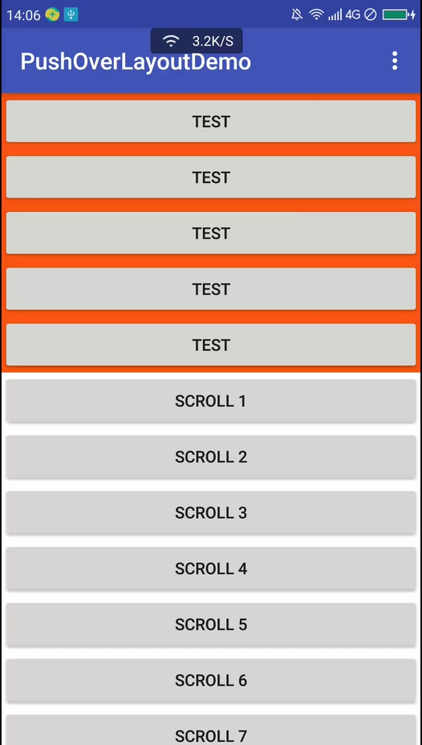
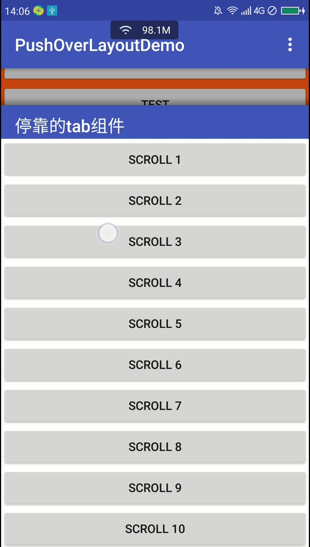
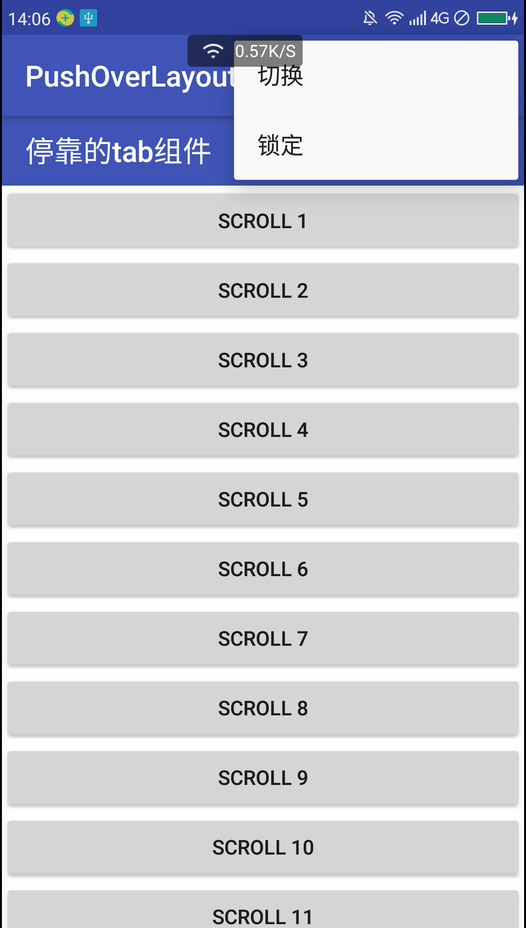

# PushOverLayout

> 浏览器项目剥离而来。
> 浏览首页上推停靠tab效果。
> 至少需要3个子View。

文档地址：

> https://ijero.github.io/javadoc/push-over-layout/library/cn.ijero.pushover/-push-over-layout/index.html

效果示例：

> <a href='resource/demo.mp4'>点击下载演示mp4</a>

  

引入项目：
> 添加源

	repositories {
	    maven {
	        url  "https://dl.bintray.com/jero/android" 
	    }
	}

> dependency

	implementation 'cn.ijero.pushover:push-over-layout:0.1.1'


使用示例：

> xml
> 
> pol_topParallax：视差变化率（0.1F~1.0F）
> 
> pol_overBackgroundEnable：是否显示覆盖层
> 
> pol_shadowEnable：是否显示阴影

```
app:pol_topParallax="0.8"
app:pol_overBackgroundEnable="true"
app:pol_shadowEnable="true"
```

> java属性使用示例

```
// 在Activity中设置监听
pushOverLayout.listenPushChanged = this@MainActivity

// 锁定状态（只锁定手势操作，开关不受限制）
pushOverLayout.lockCurrentState = false

// TopView的背景覆盖层显示
pushOverLayout.overBackgroundEnable = true

// 显示阴影
pushOverLayout.shadowEnable = true

// 设置视差变化率
pushOverLayout.topParallax = 0.6F

```

> java方法使用示例：

```
// 切换状态
pushOverLayout.toggle()

// 获取当前的状态是否是停靠状态
pushOverLayout.isSnapped()

// 同：属性 pushOverLayout.lockCurrentState = true
pushOverLayout.lock()

// 同：属性 pushOverLayout.lockCurrentState = fasle
pushOverLayout.unlock()

// 获取锁定状态，同：pushOverLayout.lockCurrentState
pushOverLayout.isLocked()

// 设置停靠状态, SnapState.SNAP 或 SnapState.NORMAL
pushOverLayout.snapTo(state: SnapState)
```

实现PushOverLayout.OnPushChangedListener接口，并覆盖以下回调方法，便于针对监听实现更多的效果：

```
override fun onPushChanged(offsetPixel: Float, percentage: Float) {
    info {
        "onPushChanged : offsetPixel = $offsetPixel"
    }
}

override fun onSnapOffsetChanged(offsetPixel: Float) {
    info {
        "onSnapOffsetChanged : offsetPixel = $offsetPixel"
    }
}

override fun onTopOffsetChanged(offsetPixel: Float) {
    info {
        "onTopOffsetChanged : offsetPixel = $offsetPixel"
    }
}
override fun onPushStateChanged(state: PushOverLayout.SnapState) {
	info {
		"onPushStateChanged : state = $state"
	}
}
```